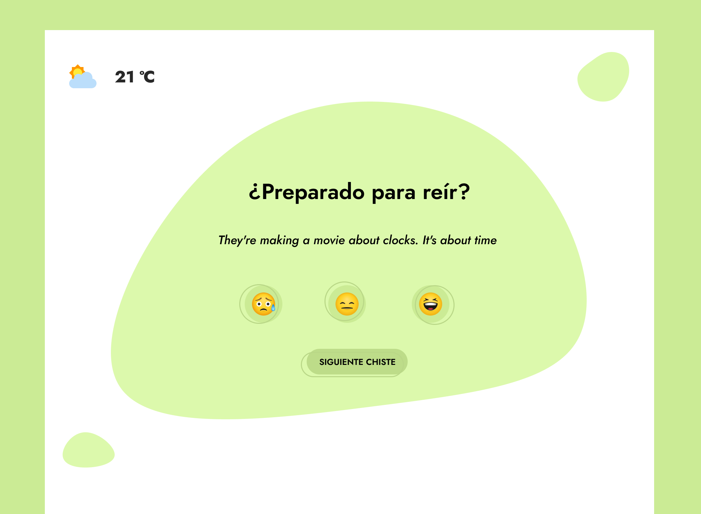

# Sprint 5 IT Academy | Acudits
## TypeScript & API

## [Live Site]()

## Introducción

Una empresa de coaching está llevando a cabo un experimento a empresas de Barcelona, en el que está midiendo el impacto del humor y la diversión en la productividad.
Nos han pedido una aplicación web que muestre ayudas a las personas trabajadoras antes de empezar la jornada laboral.
Será el encargado de llevar a cabo la base del proyecto para hacer una demo en tres semanas con el cliente y comenzar las pruebas con usuarios reales.

### Objetivos

- Afianzar lo aprendido en los sprints de ES6, Typescript y Maquetación.
- Consumir datos de un servidor mediante el uso de una API.
- Mostrar al usuario los datos procedentes de la API.
