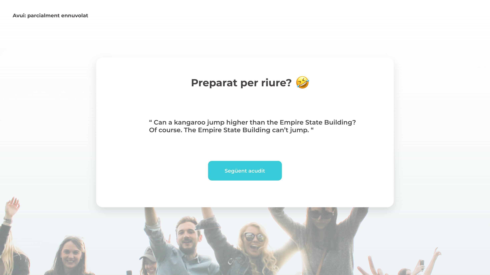

# Nivel 1 ⭐️

## Ejercicio 1

En este primer ejercicio crearemos la pantalla principal que mostrará chistes al usuario/a.

**El funcionamiento debe ser el siguiente:**

→  Al entrar no mostrará ningún chiste. Aparecerá el título y el botón de siguiente chiste.
→  Al pulsar el botón de “Siguiente chiste” se hará fetch en la API de chistes y se mostrará por consola el chiste en cuestión.

**ℹ️ Nota : En este ejercicio no es necesario maquetar la web, primero haremos que funcione para pasar a aplicarle los estilos.**

#### 🛟 Ayuda

→  Tipo 1: utilizar promises o async/await para esperar la respuesta de la API.
→  Tipo 2: antes de utilizar una API en el código, es recomendable utilizar Postman o herramientas online para probar la API, por ejemplo  -> Talend API Tester - Free Edition Además de garantizar que funciona, verás el objeto que devuelve , para saber utilizarlo.

 - [x] Entregado    📅 Fecha: 4/04/23


##  Ejercicio 2

 - [x] Entregado  📅 Fecha: 5/04/23

Nuestra web ya obtiene respuesta del servidor y los muestra por consola, falta mostrárselos al usuario/a.

Realiza una primera aproximación de la maquetación, colocando cada elemento en su sitio. No te preocupes por los detalles, modificaremos la maquetación más adelante.

El objetivo de este ejercicio es que el usuario pueda ir visualizando los chistes y pedir nuevos.

**Una referencia de la colocación de los elementos es la siguiente:**




## Nivel 2 ⭐️⭐️

### Ejercicio 3

La empresa que encarga el proyecto necesita realizar un seguimiento del uso de esta web para su estudio.
Para ello, se necesita saber el nivel de aceptación de los chistes, un tracking para saber cuándo las personas trabajadoras están de mejor humor, y cuántos chistes se consumen de media.

¿Cómo se traduce esta petición en nuestro código?

Necesitarás generar un array llamado **reportAcudits**, en el que iremos guardando toda la información relativa al chiste que nos pide el cliente/a.

**Los tres campos que debe tener cada objeto del array son:**

```
{
  broma: "...",
  puntuación: 1,
  fecha: ...

}
```


La fecha de cuándo se hizo la valoración  deberás guardarla en formato ISO.

#### ℹ️  Para saber más
[-> Fecha de JavaScript para ISOString() ](https://www.w3schools.com/Jsref/jsref_toisostring.asp)


- El campo score tiene un rango del 1 al 3, siendo un 1 la peor puntuación. 
- Deberás implementar 3 botones entre el chiste y el botón para cargar el siguiente chiste, para que el usuario pueda puntuarlo.

- Los botones de votación no se mostrarán inicialmente, sólo cuando se empiecen a mostrar los chistes.

- La votación del chiste por parte del usuario/a es opcional (se puede pasar al siguiente chiste sin hacer votación alguna).

- Una vez el usuario/a realiza una votación, puede cambiar su votación antes de pasar al siguiente chiste.

- Con la puntuación del chiste, junto con el chiste y generando una fecha, deberás ir cumplimentando el array ```reportJokes ```

Cuando vayas actualizando este array, mostrando por consola su contenido será suficiente.


 - [ ] Entregado  📅 Fecha: 